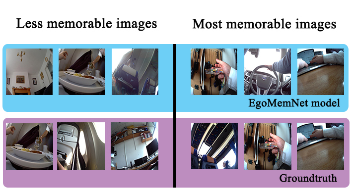

# EgoMemNet: Visual Memorability Adaptation to Egocentric Images

| ![Marc Carné][MarcCarne-photo]  | ![Xavier Giro-i-Nieto][XavierGiro-photo]   | ![Petia Radeva][PetiaRadeva-photo]  | ![CathalGurrin][CathalGurrin-photo]  |
|:-:|:-:|:-:|:-:|:-:|
| Marc Carné  | [Xavier Giro-i-Nieto][XavierGiro-web]   | [Petia Radeva][PetiaRadeva-web] | [Cathal Gurrin][CathalGurrin-web]   |

[CathalGurrin-web]: https://www.insight-centre.org/users/cathal-gurrin
[PetiaRadeva-web]: http://www.cvc.uab.es/~petia/
[XavierGiro-web]: https://imatge.upc.edu/web/people/xavier-giro

[MarcCarne-photo]: ./authors/MarcCarne.jpg "Marc Carné"
[PetiaRadeva-photo]: ./authors/PetiaRadeva.jpg "Petia Radeva"
[CathalGurrin-photo]: ./authors/CathalGurrin.jpg "Cathal Gurrin"
[XavierGiro-photo]: ./authors/XavierGiro.jpg "Xavier Giro-i-Nieto"

A joint collaboration between:

| ![logo-insight] | ![logo-dcu] | ![logo-upc] | ![logo-ub] |
|:-:|:-:|:-:|:-:|
| [Insight Centre for Data Analytics][insight-web] | [Dublin City University (DCU)][dcu-web]  |[Universitat Politecnica de Catalunya (UPC)][upc-web]   | [Universitat de Barcelona (UB)][ub-web]  |

[insight-web]: https://www.insight-centre.org/
[dcu-web]: http://www.dcu.ie/
[upc-web]: http://www.upc.edu/?set_language=en
[ub-web]: http://www.ub.edu/web/ub/en/
[gpi-web]: https://imatge.upc.edu/web/

[logo-insight]: ./logos/insight.jpg "Insight Centre for Data Analytics"
[logo-dcu]: ./logos/dcu.png "Dublin City University"
[logo-upc]: ./logos/upc.jpg "Universitat Politecnica de Catalunya"
[logo-ub]: ./logos/ub.jpg "Universitat de Barcelona"

## Abstract

This work explores the adaptation of visual memorability prediction for photos intentionally captured by handheld cameras, to images passively captured from an egocentric point of view by wearable cameras.
The estimation of a visual memorability score for an egocentric images is a valuable cue when filtering among the large amount of photos generated by wearable cameras.
Our work illustrates that state of the art techniques on visual memorability prediction require an adaptation to egocentric vision to achieve acceptable level of performance.
For this purpose, a new annotation tool and annotated dataset are presented.
This training data has been used to fine-tune a pre-trained convolutional neural network by means of a novel temporally-driven data augmentation technique.

## Publication

Acceptance pending.

## Visual Results

## Visual Memory game
The visual memory game for annotation proposed in this work is online available [here](http://imatge.upc.edu:8000). It is important to open the game in a CHROME browser.

### Game Features
* 9 minuts task.
* Users must press 'd' when repetition of an image is detected.
* Output: text file, downloaded in the client machine (downloads local folder).

### Game Technical Features

This game has been inspired in the game from MIT to replicate the results, because the code for the game are not available.
In that game there are two types of images: the first one are images that we want to detect and annotate, called targets. The second type are the fillers, images that goes between targets. Some of these fillers are vigilance fillers, randomly selected, but them function is to control that user are doing the work well.
Targets can only appear twice and fillers have no limit of shows.

The repetition of targets are between 8 and 40 images (without count blank frame, and the images between the repetition can be other targets or fillers). The sequence of images also has a blank frame with the function of focusing user attention in the center of the image. This attention frame contains a small black square at the center of a white background.
Between targets, fillers are added and the number of these fillers is between 0 and 3 randomly selected.

This game is a web application developed in HTML code for the instructions and show the image. The algorithm that make image sequence is in JavaScript. Both codes are linked and variables are shared between them. The output of the game is a text file where each line corresponds to an image and there are different values separated by comas. The first value corresponds to the image name to identify it. The second value means if the image has been shown during the game. If the value is equal to 1, the image has been shown and the next two values corresponds to the first and second time of view (in number of frames from the begin). The last value is equal to 1 if the user have detected the image at his repetition.

The last line of the file corresponds to user statistics based on user attention. Using the vigilance fillers that we supervise, we can identify how many vigilance fillers have been detected. We do a detection rate and if this rate is equal or high than 0.5 we use this results for annotate the image.

The same collection of images is shown in a random order to a team of annotators, whose goal is to detect all repetitions.

Our choice of targets and fillers should not contain images which are too similar and that could confuse the annotator.

The Insight dataset contains 50 images used as targets for the annotation tool. These images were captured with an Autographer wearable camera, together with the wearer's heart rate and galvanic skin response.  
This dataset was built from a uniform sampling from a lifelogging record of 25 days, which corresponds to 16,000 imatges.

The UTEgocentric dataset (Grauman et al.) contains 4 videos from head-mounted cameras, each about 3-5 hours long, captured in a very uncontrolled setting.
The videos were sampled, extracting frames at a fixed interval of time, in this case every 30 seconds, to simulate the capture by an low sampling rate camera. The appearance of these frames is similar to the Anonymous dataset, in this way, we can help to reduce the probability that any filler image is similar to a target images, yet retaining the egocentric-nature of the images. The number of filler images is 540, much higher than the number of targets in order to achieve a non-repetition of fillers and focus user attention to targets.

## Training
As explained in our paper, our networks were trained on the training and validation data provided by Insight dataset, created in this work.

## Fine-tune
Three different strategies used in data augmentation to avoid overfitting during fine-tunning:
* No augmentation.
* Spatial data augmentation (SDA), 10 transformations per image: cetral crop, four corners and their correspondent x-axis flips.
* Temporal data augmentation (TDA), similar temporal neighbours.

## EgoMemNet

You can download our best result, EgoMemNet, from [here](https://imatge.upc.edu/web/sites/default/files/projects/1634/public/egocentric/2016-egomemnet/EgoMemNet.caffemodel).

## Software framework

The presented convolutional neural network was developed over [Caffe](http://caffe.berkeleyvision.org/) by [Berkeley Vision and Learning Center (BVLC)](http://bvlc.eecs.berkeley.edu/). You will need to follow [these instructions](http://caffe.berkeleyvision.org/installation.html) to install Caffe.

## Technical support

We would like to especially thank Albert Gil Moreno and Josep Pujal from our technical support team at the Image Processing Group at the UPC.

| ![AlbertGil-photo]  | ![JosepPujal-photo]  |
|:-:|:-:|
| [Albert Gil](AlbertGil-web)  |  [Josep Pujal](JosepPujal-web) |

[AlbertGil-photo]: ./authors/AlbertGil.jpg "Albert Gil"
[JosepPujal-photo]: ./authors/JosepPujal.jpg "Josep Pujal"

[AlbertGil-web]: https://imatge.upc.edu/web/people/albert-gil-moreno
[JosepPujal-web]: https://imatge.upc.edu/web/people/josep-pujal

## Acknowledgements

| ![logo-ajterrassa] | ![logo-erasmus] | ![logo-cst] |
|:-:|:-:|:-:|
| [Ajuntament de Terrassa][ajterrassa-web] | [Erasmus +][erasmus-web]  |[Consorci Sanitari de Terrassa (CST)][cst-web]   |

[ajterrassa-web]: https://www.terrassa.cat
[erasmus-web]: http://www.oapee.es/oapee/inicio/ErasmusPlus.html
[cst-web]: http://www.cst.cat

[logo-ajterrassa]: ./logos/ajterrassa.jpg "Ajuntament de Terrassa"
[logo-erasmus]: ./logos/erasmus.jpg "Erasmus +"
[logo-cst]: ./logos/cst.jpg "Consorci Sanitari de Terrassa"

## Contact

If you have any general doubt about our work or code which may be of interest for other researchers, please drop us an e-mail at <mailto:marc.carne.herrera@estudiant.upc.edu> or <mailto:xavier.giro@upc.edu>.

